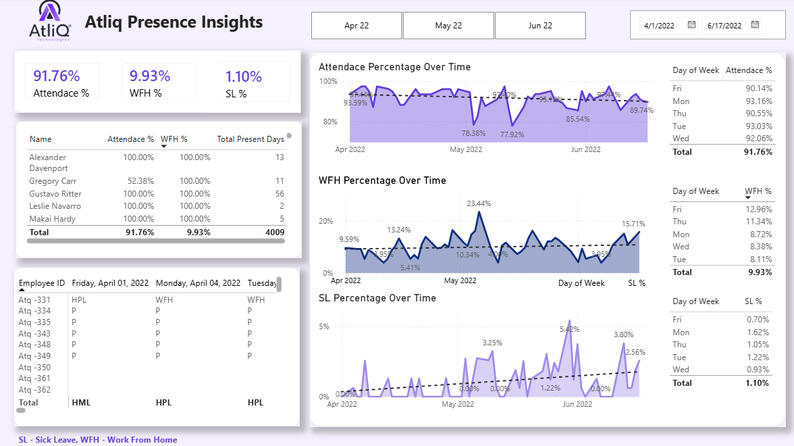

# 📊 Hybrid Workforce Attendance Analysis 
## ( Interactive Dashboard creation using Powerbi)
## Problem Statement
The HR team stored attendance data in three separate monthly files, making it difficult to monitor employee attendance and hybrid work behavior. They needed a centralized solution to track WFH/WFO trends, analyze sick leave patterns, optimize office space usage, and support workforce planning decisions.

To solve this problem, I built an automated Power BI dashboard that consolidates attendance data into a single source of truth and provides actionable insights for data-driven HR decisions.

## Dataset use
[Download raw-data.xlsx](https://github.com/hitrangnek/project-hr-analyst-atliq/blob/main/raw-data.xlsx)
## Action Workflow
* Combined attendance data from three monthly files into one centralized dataset to create a single source.
*  Verify data for any missing values and anomalies, and sort out the same.
* Standardized the data to ensure all dates, categories, and values were consistent and easy to analyze.
* Created key metrics to measure employee attendance, work-from-home (WFH) usage, and sick leave trends.
* Created DAX measures to calculate key metrics
* Design an interactive dashboard to visualize attendance trends, WFH distribution by day of the week, and sick leave patterns over time

## Dashboard

* ## Key Insights

* Employee attendance was generally high, with an average attendance rate of **91.76%**. On average, employees worked from home **9.93%** of the time, while **1.10%** were on sick leave.

* Employees were more likely to work from home on **Thursdays and Fridays**, while **Mondays and Tuesdays** had the highest number of employees working in the office.

* Sick leave increased during **late May and early June**, which may be related to seasonal weather changes and the spread of common illnesses.

* Attendance reached its lowest point (**77.92%**) in **mid-May**. During the same period, both work-from-home and sick leave rates increased, suggesting that employees may have preferred to work remotely or take time off when they were not feeling well.

## Recommendations

* **Optimize office space:**  The company could recommend Thursdays and Fridays as WFH days, as these are the days when employees are most likely to work remotely. This would help manage office capacity more efficiently and reduce rental costs, especially when office space cannot accommodate all employees at the same time.

* **Plan team activities on high-attendance days:** Team meetings, workshops, and collaborative activities should be scheduled on Mondays and Tuesdays because these days have the highest in-office attendance rates (93.16% and 93.03%).

* **Prepare for seasonal sick leave:** Since this is a technology company, higher sick leave rates may affect software releases and project deadlines. The company should plan ahead, create backup plans, and adjust project timelines to avoid delays when fewer employees are available.

